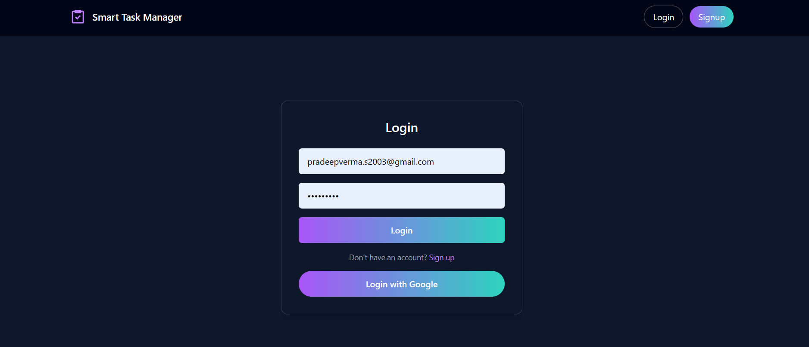
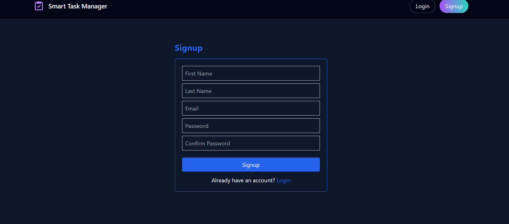

# 🚀 Smart Task Manager


A full-stack Smart Task Manager built using the MERN stack (MongoDB, Express.js, React, Node.js).  
Manage your daily tasks with authentication, drag & drop, filtering, and a modern UI.

---

## 📸 Screenshots






---

## 🌟 Features

- 🔐 User Authentication (JWT + Google OAuth)
- 📝 Create, Update, Delete Tasks
- 📊 Task Status (To Do, In Progress, Done)
- 🔄 Drag & Drop Tasks
- 🔍 Search & Filter
- ⚡ Optimized UI with React Query
- 🛡️ Protected Routes
- 📱 Responsive Design

---

## 🛠️ Tech Stack

### Frontend
- React (Vite)
- Redux Toolkit
- React Router
- React Query
- Tailwind CSS
- Axios
- Firebase (Google Auth)

### Backend
- Node.js
- Express.js
- MongoDB (Mongoose)
- JWT Authentication
- Bcrypt.js
- Cookie Parser

---

## 🚀 Live Demo

👉 https://taskmanger-4sy5.onrender.com

---

## ⚙️ Run Locally

### 1. Clone repo

```bash
git clone https://github.com/PRADEEVERMA/Smart-Task-Manager.git
cd Smart-Task-Manager
