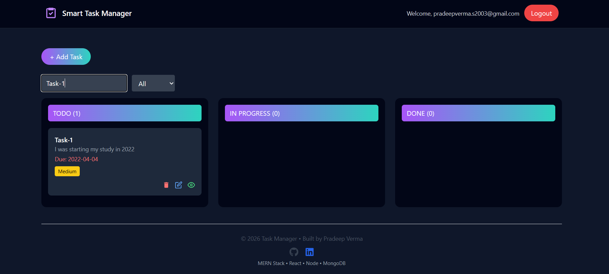
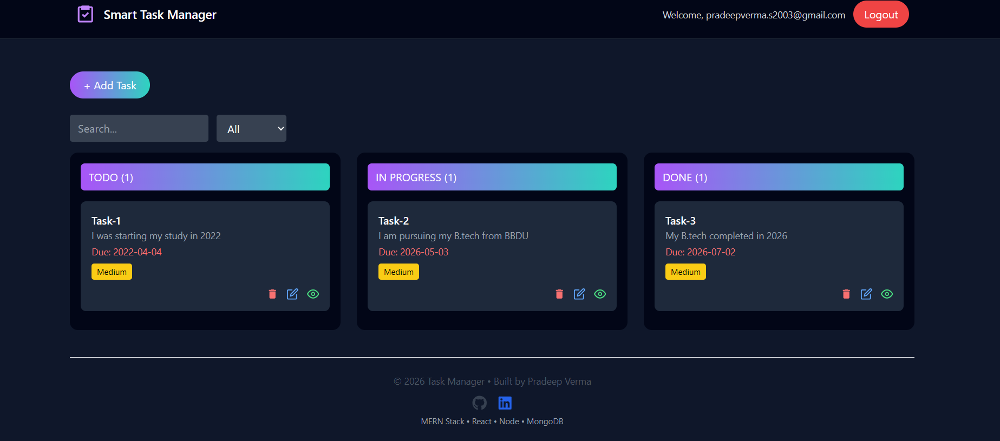
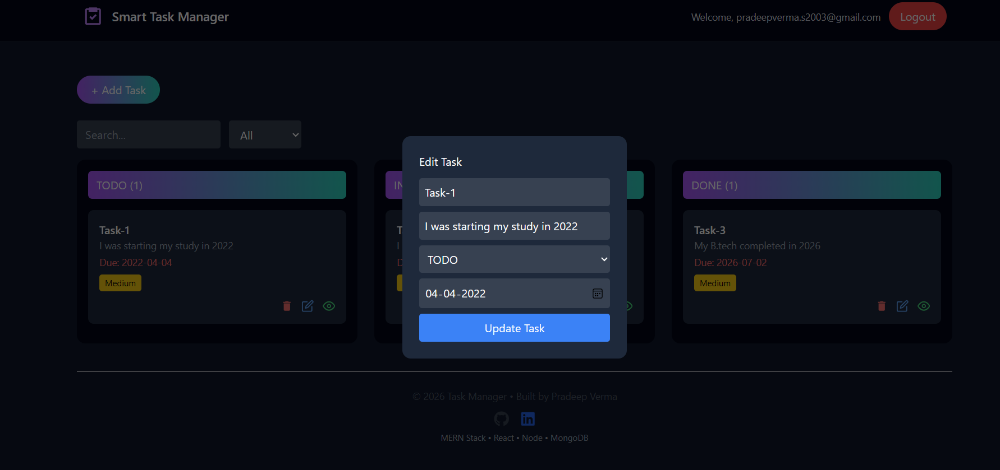

# 🚀 Smart Task Manager


A full-stack Smart Task Manager built using the MERN stack (MongoDB, Express.js, React, Node.js).
Manage your daily tasks with authentication, drag & drop, filtering, and a modern UI.

---

## 📸 Screenshots






---

## 🌟 Features

* 🔐 User Authentication (JWT + Google OAuth)
* 📝 Create, Update, Delete Tasks
* 📊 Task Status (To Do, In Progress, Done)
* 🔄 Drag & Drop Tasks
* 🔍 Search & Filter
* ⚡ Optimized UI with React Query
* 🛡️ Protected Routes
* 📱 Responsive Design

---

## 🛠️ Tech Stack

### Frontend

* React (Vite)
* Redux Toolkit
* React Router
* React Query
* Tailwind CSS
* Axios
* Firebase (Google Auth)

### Backend

* Node.js
* Express.js
* MongoDB (Mongoose)
* JWT Authentication
* Bcrypt.js
* Cookie Parser

---

## 🚀 Live Demo

👉 https://taskmanger-4sy5.onrender.com

---

## ⚙️ Run Locally

### 1. Clone repo

```bash
git clone https://github.com/PRADEEVERMA/Smart-Task-Manager.git
cd Smart-Task-Manager
```

---

### 2. Backend Setup

```bash
cd backend
npm install
```

Create `.env`:

```env
PORT=5000
MONGO_URI=xxxxxxxxx
JWT_SECRET=your_secret
COOKIE_SECRET=your_cookie_secret
FRONTEND_BASE_URL=http://localhost:5173
```

Run backend:

```bash
npm start
```

---

### 3. Frontend Setup

```bash
cd ../frontend
npm install
```

Create `.env`:

```env
VITE_BACKEND_BASE_URL=http://localhost:5000
VITE_FIREBASE_API_KEY=your_key
```

Run frontend:

```bash
npm run dev
```

---

## 🚀 Future Improvements

* 👤 User Profile
* 🔔 Notifications
* 🌙 Dark Mode
* 📊 Analytics Dashboard

---

## 👨‍💻 Author

**Pradeep Verma**

* 🔗 GitHub: https://github.com/PRADEEVERMA
* 🔗 LinkedIn: https://www.linkedin.com/in/pradeep-verma-533216318/

---

⭐ If you like this project, give it a star ⭐
